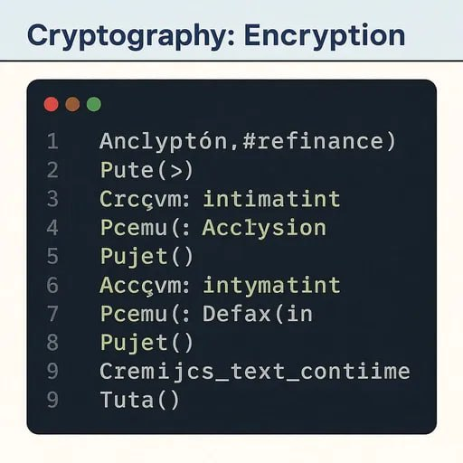

# Що таке криптографія?

## Криптографія — це наука про захист інформації за допомогою шифрування. Вона дозволяє зробити дані недоступними для сторонніх осіб під час зберігання або передавання.

## Типи шифрування:

### 1. Симетричне шифрування
- Один ключ використовується для шифрування і розшифрування.
- Простий приклад: шифр Цезаря – кожну букву зсувають на фіксовану кількість позицій.  
**Приклад:** “Привіт” → (зсув на 3) → “Тулглч”

### 2. Асиметричне шифрування
- Використовуються два ключі: відкритий (public) і закритий (private).
- Відомий алгоритм — **RSA**, використовується в банківських системах, месенджерах, електронних підписах.

---

## Хешування

**Хеш-функція** — це одностороння функція, яка перетворює довільне повідомлення у фіксовану послідовність символів (хеш).  
Хеші **не можна "розшифрувати"**, але їх можна порівнювати.

**Приклад хешу** слова “Криптографія” (SHA-256):  
`33fd70ec33eeb5b7e93e84debf8d86fc...`

